# Earthing System — the physics and mathematics behind every page

A teaching companion. `METHODS.md` lists *what* each equation is and where it comes from;
this document explains *why* it has that form, derives it where the derivation is short
enough to be worth seeing, and works through the numbers.

It is written to be taught from. Each chapter follows the same shape: the physical
question, the derivation, a worked example with real numbers, and a note on what makes
the result pass or fail.

---

## Contents

1. [The physics of earthing](#1-the-physics-of-earthing)
2. [Soil — module 1](#2-soil--module-1)
3. [Fault current — module 2](#3-fault-current--module-2)
4. [Conductor sizing — module 3](#4-conductor-sizing--module-3)
5. [Safety criteria — the heart of module 4](#5-safety-criteria--the-heart-of-module-4)
6. [Grid resistance — module 4](#6-grid-resistance--module-4)
7. [Mesh and step voltage — module 4](#7-mesh-and-step-voltage--module-4)
8. [The numerical solver — module 5](#8-the-numerical-solver--module-5)
9. [Buildings and homes — module 6](#9-buildings-and-homes--module-6)
10. [Lightning — module 7](#10-lightning--module-7)
11. [Air termination and protection zones — module 8](#11-air-termination-and-protection-zones--module-8)
12. [System neutral grounding — module 9](#12-system-neutral-grounding--module-9)
13. [Reading a verdict](#13-reading-a-verdict)
14. [A suggested teaching sequence](#14-a-suggested-teaching-sequence)
15. [Symbols](#15-symbols)
16. [The wider standards landscape](#16-the-wider-standards-landscape)

---

## 1. The physics of earthing

### 1.1 What problem are we actually solving

Earthing is not about "getting rid of" current. It is about **controlling the potential
of the soil surface** while a fault current flows through it, so that no person standing
on that surface can have a dangerous current pass through their body.

Everything else — resistance, conductor size, mesh spacing — is downstream of that one
requirement.

### 1.2 Current in a conducting half-space

Take a small hemispherical electrode of radius `a` at the surface of soil of resistivity
ρ, injecting a current `I`. By symmetry the current spreads radially. At radius `r` it
crosses a hemisphere of area 2πr², so the current density is

```
J(r) = I / (2πr²)
```

Ohm's law in local form gives the electric field `E = ρJ`, and the potential at radius
`r` relative to infinity is the integral of that field:

```
V(r) = ∫r^∞ ρ I /(2πr'²) dr' = ρI / (2πr)          … (1.1)
```

This single expression is the seed of almost everything in the software. Two consequences
matter enormously:

**Consequence 1 — the resistance lives next to the electrode.**
The resistance between radius `r₁` and `r₂` is `ρ/(2π)·(1/r₁ − 1/r₂)`. Put in numbers for
a 0.5 m hemisphere in 100 Ω·m soil: from 0.5 m to 1 m you accumulate 15.9 Ω; from 1 m to
10 m, 14.3 Ω; from 10 m to infinity, only 1.6 Ω. **Half the total resistance is inside the
first metre.** That is why the *shape and size* of the electrode dominates, why driving a
rod deeper helps more than driving many short ones, and why the soil far away is almost
irrelevant.

**Consequence 2 — the potential gradient at the surface is steepest near the electrode.**
`dV/dr = −ρI/(2πr²)`. That gradient is exactly the step voltage a person walking there
would experience. It is why step voltage is worst at the edge of the grid, not in the
middle.

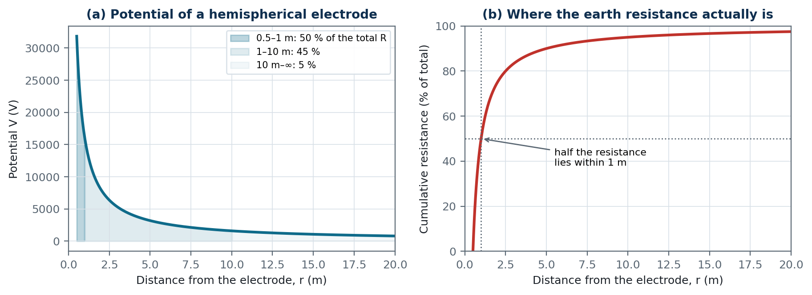

*Figure 1 — Potential around a hemispherical electrode in 100 Ω·m soil, and the cumulative resistance. Half of the total earth resistance is accumulated within the first metre — which is why electrode geometry matters far more than distant soil.*

### 1.3 Ground potential rise, touch and step voltage

When the fault current `I_G` flows into an earthing system of resistance `R_g`, the whole
metal structure rises to

```
GPR = I_G · R_g          … (1.2)
```

above true remote earth. That is not in itself dangerous — a bird on a wire is at 20 kV
and perfectly well. Danger comes from **differences**:

- **Touch voltage** `U_T` — between earthed metal a person is holding (at GPR) and the
  soil under their feet, one metre away (at some lower potential `V_s`):
  `U_T = GPR − V_s`.
- **Step voltage** `U_S` — between the soil under one foot and the soil under the other,
  one metre apart: `U_S = V(x) − V(x+1)`.
- **Transferred potential** — when a conductor carries GPR *outside* the grid, so that
  someone standing on remote soil touches metal at full GPR. This is the most dangerous
  case of all, because the full GPR appears across the person; it is handled by isolation
  and bonding rules rather than by a formula.

The whole design problem is: **make the soil surface follow the metal as closely as
possible**, so those differences stay small.

> One metre is not arbitrary. It is the conventional reach of an arm and the conventional
> length of a stride, and it is baked into every tolerable-voltage formula in IEEE 80.

### 1.4 The human body as a circuit element

To turn "dangerous" into a number we need a circuit. IEEE 80 uses:

- **Body resistance** `R_B = 1000 Ω` — hand-to-both-feet or foot-to-foot, a deliberately
  conservative single value that ignores skin resistance.
- **Foot resistance.** A foot is modelled as a metallic disc of radius `b = 0.08 m`
  resting on the soil. The resistance of a disc electrode on a half-space is a classical
  result:

```
R_f = ρ / (4b) = ρ / (4 × 0.08) = 3.125 ρ ≈ 3ρ          … (1.3)
```

Now build the two circuits:

| Case | Feet | Foot network | Total series resistance |
|---|---|---|---|
| Touch (hand → both feet) | parallel | `3ρ/2 = 1.5ρ` | `R_B + 1.5ρ` |
| Step (foot → foot) | series | `2 × 3ρ = 6ρ` | `R_B + 6ρ` |

**Those two numbers, 1.5 and 6, are the entire reason the touch and step formulas look
different.** Nothing else changes between them.

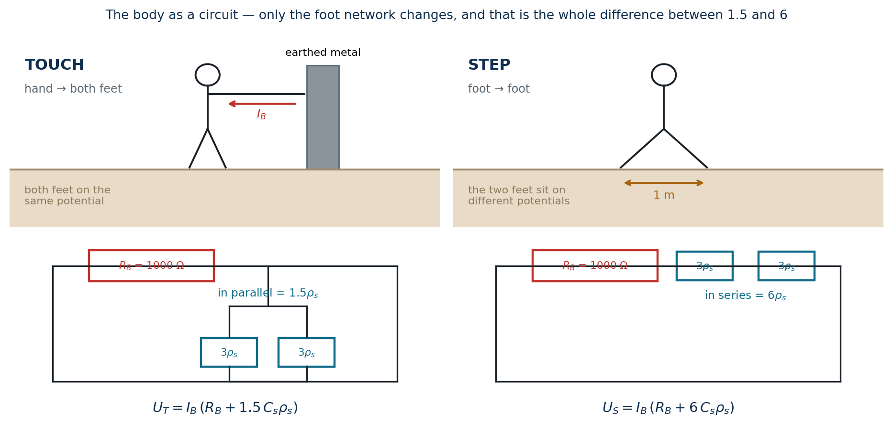

*Figure 2 — The body as a circuit. The body resistance and the foot resistance are the same in both cases; only the way the two feet are connected changes — parallel for touch, series for step.*

### 1.5 How much current is too much — Dalziel

Ventricular fibrillation is an energy phenomenon, not a pure current one. Dalziel's
experimental work gives a constant-energy law:

```
I_B² · t = S_B     ⟹     I_B = k / √t          … (1.4)
```

with `S_B = 0.0135` for a 50 kg body (`k = √0.0135 = 0.116`) and `S_B = 0.0246` for
70 kg (`k = 0.157`). Valid for shock durations from about 0.03 s to 3 s.

The `1/√t` is why **clearing time is such a powerful design lever**: halving the fault
duration raises every tolerable voltage by √2 ≈ 41 %.

### 1.6 Putting it together

Tolerable voltage = (tolerable current) × (circuit resistance):

```
E_touch = I_B (R_B + 1.5 C_s ρ_s) = (1000 + 1.5 C_s ρ_s) · k/√t_s     … (1.5)
E_step  = I_B (R_B + 6.0 C_s ρ_s) = (1000 + 6.0 C_s ρ_s) · k/√t_s     … (1.6)
```

You have now derived IEEE 80 Equations (29) to (33) from first principles. `C_s` and `ρ_s`
are explained in §5.

---

## 2. Soil — module 1
### 2.1 What resistivity is, and what moves it

Soil conducts through **electrolyte in its pores**, not through the mineral grains. So
resistivity is governed by moisture content, dissolved salts and temperature — not by what
the rock is made of. Practical consequences:

- Resistivity can change by a factor of 10 between wet and dry season. An electrode
  measured in spring can be twice as bad in August.
- Below 0 °C resistivity rises steeply as pore water freezes: near −5 °C it can be 3–5×
  the value at +10 °C. Electrodes are therefore driven below the frost line.
- Resistivity falls with depth in most sites, because deeper soil stays moist. This is
  precisely why a two-layer model with `ρ₂ < ρ₁` is so common, and why a long rod that
  reaches the lower layer is worth many short ones.

### 2.2 The Wenner array — deriving ρₐ = 2πaR

Four electrodes in a line, equally spaced by `a`. Current `I` enters at C1 and leaves at
C2; the voltage between the inner pair P1, P2 is measured.

Using (1.1) and superposing the source and the sink:

```
V(P1) = ρI/(2π) · [ 1/a − 1/(2a) ] =  ρI/(4πa)
V(P2) = ρI/(2π) · [ 1/(2a) − 1/a ] = −ρI/(4πa)

ΔV = V(P1) − V(P2) = ρI/(2πa)
```

so, with `R = ΔV/I`,

```
ρₐ = 2π a R          … (2.1)
```

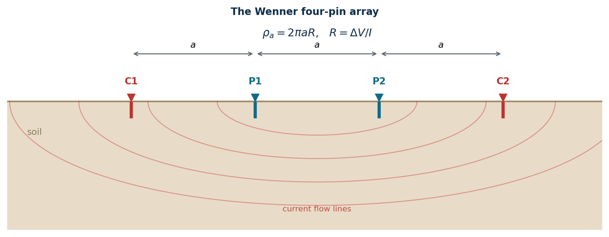

*Figure 3 — The Wenner four-pin array. Current is injected at C1 and collected at C2; the potential difference between P1 and P2 gives the apparent resistivity directly.*

**What `a` means physically.** There is a persistent teaching shortcut that "the Wenner
array reads the resistivity down to a depth of `a`". It is a shortcut, not a theorem: the
measurement is a weighted average over a volume whose *median* depth of investigation is
roughly `a/2` to `a`, with contributions from much deeper. That is exactly why we do not
use the raw numbers as a layer model — we **invert** them.

Practical rules for the traverse: use spacings in a roughly logarithmic ladder
(0.5, 1, 2, 3, 5, 8, 12, 20, 30 m), extend the largest spacing to at least the diagonal of
the planned grid, and run at least two traverses at right angles.

### 2.3 The Schlumberger array

Outer (current) electrodes at ±s, inner (potential) electrodes separated by `d ≪ 2s`:

```
ρₐ = π R (s² − (d/2)²) / d          … (2.2)
```

Its advantage is that you move only the outer pair between readings, so the small,
noise-sensitive potential electrodes stay put. Its limitation is that as `s/d` grows the
measured voltage shrinks, so eventually you must widen `d`.

### 2.4 The two-layer earth and the image series

Now put a horizontal interface at depth `h` between resistivity `ρ₁` above and `ρ₂` below.
This is the classical method-of-images problem, exactly analogous to optics: the interface
partially "reflects" the current source, with a reflection coefficient

```
K = (ρ₂ − ρ₁) / (ρ₂ + ρ₁),     −1 ≤ K ≤ +1          … (2.3)
```

`K > 0` means the lower layer is more resistive (current is pushed back up), `K < 0` means
it is more conductive (current is drawn down). `K = 0` is uniform soil.

Each reflection produces an image source at `2nh`, weighted by `Kⁿ`. Summing over all
reflections and then over the four Wenner electrodes gives

```
ρₐ(a) = ρ₁ [ 1 + 4 Σ(n=1..∞) Kⁿ ( 1/√(1+(2nh/a)²) − 1/√(4+(2nh/a)²) ) ]     … (2.4)
```

and for Schlumberger

```
ρₐ(s) = ρ₁ [ 1 + 2 Σ(n=1..∞) Kⁿ / (1 + (2nh/s)^2)^(3/2) ]                   … (2.5)
```

**Sanity checks a student should do themselves:**
- Set `K = 0`: every term vanishes and `ρₐ = ρ₁`. Correct — uniform soil.
- Let `a → 0`: `2nh/a → ∞`, all terms vanish, `ρₐ → ρ₁`. Correct — a very short array only
  sees the top layer.
- Let `a → ∞`: the series converges to a value that can be shown to give `ρₐ → ρ₂`.
  Correct — a very wide array only sees the bottom layer.

Because `|K| < 1` the series converges geometrically. Earthing System truncates it when
`|K|ⁿ < 10⁻⁶`, which for `K = 0.8` needs 62 terms and for `K = 0.3` only 12.

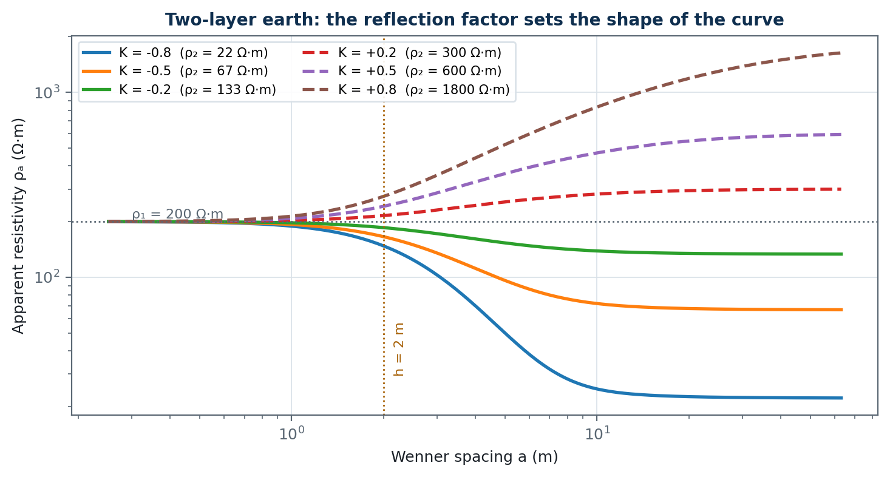

*Figure 4 — Apparent resistivity over a two-layer earth for a range of reflection factors, with ρ₁ = 200 Ω·m and h = 2 m. Short spacings always read ρ₁; long spacings tend to ρ₂. The transition happens around a ≈ h.*

### 2.5 Inversion — fitting the model to the field data

We measure `ρₐ` at several spacings and want `(ρ₁, ρ₂, h)`. This is a three-parameter
non-linear least-squares problem. Earthing System minimises the **relative** residual

```
Φ(ρ₁, ρ₂, h) = Σᵢ [ (ρₐ,model(aᵢ) − ρₐ,meas(aᵢ)) / ρₐ,meas(aᵢ) ]²          … (2.6)
```

Two deliberate choices are worth teaching:

1. **Relative, not absolute, residuals.** Apparent resistivity often spans a decade across
   the traverse. An absolute-error fit would be dominated by the largest values and would
   fit the deep soil while ignoring the shallow soil — which is where the electrodes are.
2. **Optimise in log space.** The search variables are `ln ρ₁, ln ρ₂, ln h`. This keeps
   every parameter positive automatically with no constraints, and makes the search scale-
   free: a factor-of-two error costs the same whether the value is 10 or 10 000.

The optimiser is a Nelder–Mead simplex written out in `soil.py`, so the software has no
SciPy dependency. It is started from nine different initial guesses and the best result is
kept, because the objective can have local minima when the data are noisy.

**Reading the RMS error.** Below about 5 % the two-layer model is a good description.
Between 5 % and 15 % it is usable but the site probably has three layers or lateral
variation. Above 15 % do not trust a layered model at all — go back to the field, run
perpendicular traverses, and look for buried metal (a pipe or an old cable crossing the
traverse is the classic cause of an unfittable curve).

### 2.6 Worked example

Field data (Wenner):

| a (m) | 1 | 2 | 4 | 6 | 10 | 16 |
|---|---|---|---|---|---|---|
| ρₐ (Ω·m) | 320 | 245 | 182 | 162 | 168 | 182 |

The curve falls then rises — the signature of a conductive middle layer, i.e. the true
site has three layers. Fitting two layers gives roughly `ρ₁ ≈ 378 Ω·m`, `ρ₂ ≈ 166 Ω·m`,
`h ≈ 0.96 m`, RMS ≈ 4.5 %. The fit follows the falling branch well and misses the rise at
large spacing, which is exactly what you should expect and exactly what the residual
column shows you. For a grid buried at 0.5 m this is a perfectly serviceable model,
because the electrode never sees the third layer.

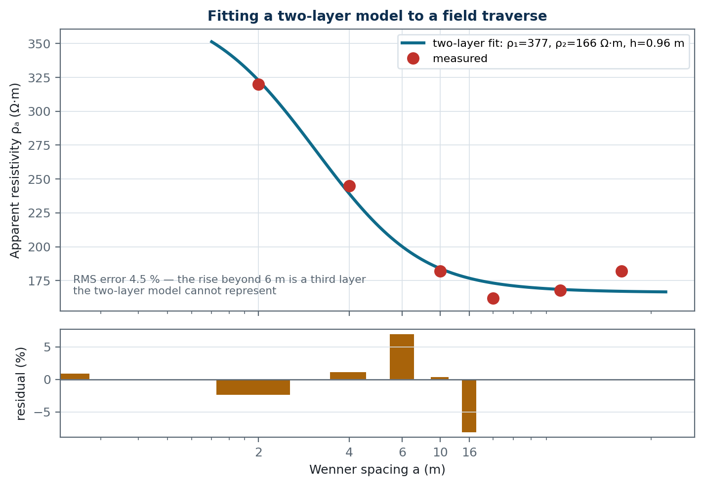

*Figure 5 — Two-layer inversion of the example traverse, with the residuals below. The fit follows the falling branch and misses the rise beyond 6 m — the signature of a third layer that a two-layer model cannot represent.*

### 2.7 Equivalent uniform resistivity

The closed-form IEEE 80 equations assume one resistivity, so the two fitted layers have
to be collapsed into one number. The question is *how deep the electrode's current goes*
— and for a grid the answer is about one grid radius, however shallow the grid is buried.
A 70 m grid at 0.5 m in 2 m of topsoil drives most of its current into the lower layer.

Version 1.2 therefore treats the grid as a disc of the same area, radius `r = √(A/π)`, on
the two-layer earth. The disc on a two-layer earth has an exact image-series solution
(the same one used for the foot and the surface layer in §5):

```
R_disc = ρ₁ F / (4r)
F(K, h/r) = 1 + (4/πr) Σₙ Kⁿ [ r·atan(r/nh) − (nh/2)·ln(1 + r²/n²h²) ]          … (2.8)
```

The conductor near field (Sverak's `ρ/L_T` term) lies in the upper layer and keeps `ρ₁`,
so the equivalent resistivity is

```
ρ_eq = ρ₁ · (F/4r + 1/L_T) / (1/4r + 1/L_T)                                        … (2.9)
```

which returns `ρ₁` exactly in uniform soil. **Pull inputs** on the grid page evaluates
(2.9) for the grid actually entered there. Checked against the two-layer numerical solver
for 48 grids (10–70 m, h = 1–30 m, ρ₂/ρ₁ = 0.1–25), the closed form with (2.9) is
conservative in every case, typically by 3–20 %.

> **What version 1.1 did.** It weighted the layers by the *burial depth* of the
> electrodes. For the IEEE 80 Annex B grid in 2 m of 400 Ω·m that gave `ρ_eq = 400` whatever
> the lower layer — a closed-form `R_g` of +191 % over 100 Ω·m and **−66 % over 1600 Ω·m**,
> the unsafe direction. The depth-weighted rule is still offered, but only for small
> electrodes (a rod or two) whose size is comparable with their depth.

The numerical solver needs none of this: it uses the layered model directly.

**Check the fit first.** A two-layer curve is monotonic. If the measured curve falls and
then rises (or the reverse) the site has at least three layers, the fitted `ρ₁` and `h` are
not physical, and module 1 now says so and asks for confirmation before a poor fit is
pulled into the grid design.

---

## 3. Fault current — module 2
### 3.1 Why symmetrical components

A single line-to-earth fault is an unbalanced condition, so the three phases cannot be
analysed independently. Fortescue's transformation splits any unbalanced set into three
balanced sets — positive, negative and zero sequence — each of which can be analysed with
an ordinary single-phase circuit.

The **zero-sequence** network is the one that matters here, because zero-sequence current
is by definition the current that is identical in all three phases and therefore must
return through earth and through any neutral or shield conductors. Earthing is, in a
precise sense, the study of the zero-sequence return path.

### 3.2 Line-to-earth fault current

Connecting the three sequence networks in series (the standard result for a single
line-to-earth fault) gives

```
I_k1" = √3 · c · Uₙ / |Z₁ + Z₂ + Z₀ + 3Z_f|          … (3.1)
```

Points to draw students' attention to:

- `3Z_f`, not `Z_f` — fault impedance appears three times because the full fault current
  `3I₀` passes through it while each sequence network carries only `I₀`.
- The **voltage factor `c`** (1.1 for MV/HV maximum) accounts for tap settings, load, and
  the tolerance on the nominal voltage. It is a deliberate conservatism, not physics.
- `Z₀` is usually very different from `Z₁`: for a line with earth return it may be 3× as
  large; for a delta-star transformer it depends entirely on the winding connection. Get
  `Z₀` wrong and the entire earthing design is wrong. This is the number most worth
  checking against the utility's own study.

Special case worth showing: if `Z₀ = Z₁ = Z₂`, then (3.1) reduces to `c·Uₙ/(√3·Z₁)`,
which is the three-phase fault current. The software's test suite checks exactly this.

### 3.3 The DC offset and the decrement factor

A short circuit does not start as a clean sinusoid. Because the circuit is inductive, the
current cannot jump, so a decaying DC component appears:

```
i(t) = √2 I [ cos(ωt + θ) − e^(−t/T_a) cos θ ],     T_a = X/(ωR) = (X/R)/(2πf)
```

The earthing system does not care about the peak; it cares about **heating and about the
rms value over the fault duration**, because both the tolerable body current and the
conductor heating are rms/energy quantities. So compute the rms of the whole waveform over
`0 … t_f`:

```
(1/t_f) ∫₀^{t_f} (√2 I e^{−t/T_a})² dt = 2I² · (T_a/2)(1 − e^{−2t_f/T_a}) / t_f
```

Adding the ac part (`I²`) and taking the ratio to the symmetrical rms gives

```
D_f = √[ 1 + (T_a/t_f)(1 − e^{−2 t_f / T_a}) ]          … (3.2)
```

**Behaviour to point out:**
- `t_f ≫ T_a` (a slow-clearing fault): `D_f → 1`. The DC offset has died long before the
  fault clears, so it contributes nothing.
- `t_f ≪ T_a` (a fast-clearing fault on a stiff, inductive system): expand the exponential
  to get `D_f → √2`. The current is essentially fully offset for the whole fault.
- Therefore **fast clearing makes `D_f` worse while making the tolerable voltage better**,
  and the tolerable voltage wins, because it goes as `1/√t` while `D_f` is capped at √2.
  This is worth showing students explicitly, because the two effects look like they might
  cancel and they do not.

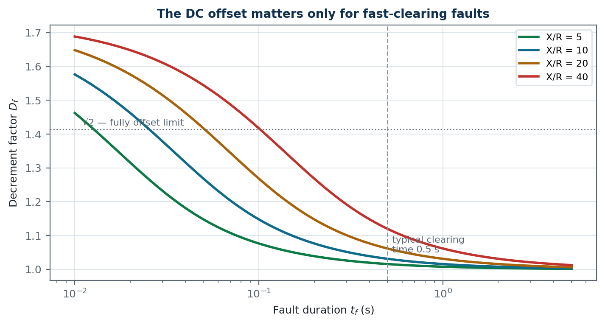

*Figure 6 — The decrement factor against fault duration for several X/R ratios. At the usual 0.5 s clearing time the DC offset contributes only a few percent; below about 0.1 s it becomes significant.*

### 3.4 The split factor `S_f`

Not all of the fault current returns through the earth grid. Any overhead earth wire,
cable sheath or distribution neutral bonded to the grid offers a metallic path in parallel
with it. The split factor is the fraction that actually goes into the soil:

```
S_f = |Z_r| / |Z_r + R_g|          … (3.3)
```

a plain current divider between the metallic return impedance `Z_r` and the grid
resistance `R_g`.

`S_f` is one of the most influential and most-often-fudged numbers in the whole design.
With no metallic return, `S_f = 1`. A transmission substation with eight shielded lines
may see `S_f ≈ 0.12` — meaning **88 % of the fault current never enters the soil**, and
the grid can be eight times smaller than a naive design would suggest. Earthing System offers
the IEEE 80 Annex C guide values as one-click chips, but a real project should use the
utility's own study.

### 3.5 Assembling the grid current

```
I_g = S_f · C_p · 3I₀        I_G = D_f · I_g          … (3.4)
```

`C_p` is the future-growth factor: fault levels rise as networks are reinforced, and an
earth grid is buried in concrete for forty years. `C_p = 1.0` means today's fault level,
`C_p = 1.25` designs for a 25 % increase.

### 3.6 Worked example

20 kV system, `S_k" = 500 MVA`, `X/R = 10`, `X₀/X₁ = 3`, `t_f = 0.5 s`, 50 Hz,
`S_f = 0.6`, `C_p = 1.0`:

```
Z₁      ≈ 0.0796 + j0.796 Ω        (from Z = c·Uₙ²/S_k")
Z₀      ≈ 0.0796 + j2.388 Ω
I_k1"   = √3 · 1.1 · 20000 / |Z₁+Z₂+Z₀| ≈ 8.69 kA
T_a     = 10/(2π·50) = 0.0318 s
D_f     = √[1 + (0.0318/0.5)(1 − e^(−31.4))] = 1.031
I_g     = 0.6 × 8.69 = 5.21 kA
I_G     = 1.031 × 5.21 = 5.37 kA
```

Note how little `D_f` contributes at 0.5 s and how much `S_f` does. Students consistently
over-focus on the first and under-focus on the second.

---

## 4. Conductor sizing — module 3
### 4.1 The adiabatic assumption

A fault lasts a fraction of a second. In that time essentially no heat escapes the
conductor into the soil, so all the `I²R` energy goes into raising the conductor's own
temperature. That is the **adiabatic assumption**, and it is what makes the problem
solvable in closed form.

Take a conductor of area `A`, length `L`, density `δ`, specific heat `c`, resistivity
`ρ_e(T) = ρ₂₀[1 + α(T − 20)]`. In time `dt`:

```
energy in  = I² · (ρ_e L / A) · dt
energy stored = (δ A L) · c · dT
```

Equating and separating variables:

```
I² dt / A² = (δ c / ρ₂₀) · dT / [1 + α(T − 20)]
```

Integrating from `T_a` to `T_m`, and defining `K₀ = 1/α − 20` so that
`1 + α(T − 20) = α(T + K₀)`:

```
I² t / A² = (δ c) / (ρ₂₀ α) · ln[ (K₀ + T_m) / (K₀ + T_a) ]
```

Writing `TCAP = δ·c` (the volumetric heat capacity) and rearranging:

```
A = I / √( (TCAP·10⁻⁴)/(t_c · α_r · ρ_r) · ln[(K₀+T_m)/(K₀+T_a)] )          … (4.1)
```

which is IEEE Std 80-2013 Equation (37). The `10⁻⁴` is a unit conversion only
(`TCAP` in J/(cm³·°C), `ρ_r` in µΩ·cm, `A` in mm², `I` in kA).

**Everything in that formula is now meaningful rather than magic**: `TCAP` is how much
heat the metal can absorb per degree, `ρ_r` is how much heat it generates, `α_r` describes
how the generation worsens as it heats up, and the logarithm is the accumulated effect of
that feedback between ambient and the limit temperature.

### 4.2 The IEC form is the same physics

IEC 60364-5-54 writes it as

```
S = √(I² t) / k,     k = √( Q_c(B + 20)/ρ₂₀ · ln[1 + (T_f − T_i)/(B + T_i)] )     … (4.2)
```

with `B = 1/α₀`. Compare term by term with (4.1): `Q_c` is `TCAP`, `B + 20` plays the role
of `K₀ + 20`, and the logarithm is identical after algebra. The IEC simply pre-computes
the whole square root into a single tabulated `k`, because in an LV installation the
material and insulation combinations are few and standard.

Consequences for teaching: the two standards **will not** give the same answer, and it is
not a mistake. IEEE 80 lets you choose `T_m` freely and use the true material constants;
IEC fixes `T_f` at the insulation limit. For a bare buried copper conductor IEEE 80 with
`T_m = 1084 °C` allows a much smaller conductor than IEC with `T_f = 500 °C`. Earthing System
computes both and selects the larger, which is the defensible engineering position.

### 4.3 What actually limits `T_m` in practice

Rarely the metal. Usually:

| Limit | `T_m` | Why |
|---|---|---|
| Exothermic weld | 1083 °C | The joint is as good as the parent metal |
| Brazed joint | 450 °C | Filler alloy softens |
| Bolted / pressure joint | 250 °C | Contact pressure relaxes, resistance runs away |

A grid welded exothermically can use half the copper of the same grid bolted together.
This one dropdown on the conductor page changes the material cost of a substation more
than any other single input.

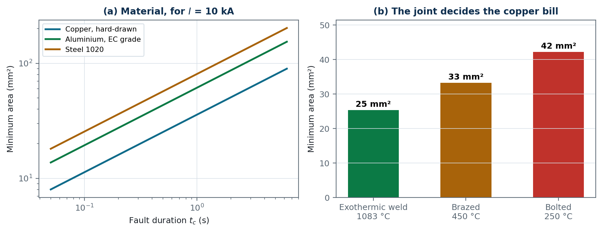

*Figure 7 — Conductor sizing. (a) The required area against fault duration for three materials. (b) The same 10 kA, 0.5 s duty sized for three joint types — the joint, not the metal, usually sets the size.*

### 4.4 The other three constraints

Thermal sizing is necessary but not sufficient. Earthing System also applies:

- **Mechanical and corrosion minima** (IEC 60364-5-54 Table 54.1). A buried conductor not
  protected against corrosion must be at least 25 mm² copper regardless of what the
  thermal calculation says — because it has to still be there in thirty years.
- **The simplified PE rule** (Table 54.2): `S ≤ 16 → S_PE = S`; `16 < S ≤ 35 → 16`;
  `S > 35 → S/2`. This is a shortcut that is always at least as conservative as the
  adiabatic calculation for the standard material pairings.
- **Bonding conductor rules** (§544): main protective bonding at least half the earthing
  conductor, minimum 6 mm², need not exceed 25 mm² copper.

The software reports all of them and selects the largest. When teaching, make students
predict which one will bind before they press the button — for domestic work it is almost
always the mechanical minimum, and for substations almost always the thermal one.

---

## 5. Safety criteria — the heart of module 4

### 5.1 The surface layer, and why it works

Spread 100 mm of crushed rock (`ρ_s` ≈ 2500 Ω·m dry) over the soil (`ρ` ≈ 100 Ω·m) and the
foot resistance rises enormously — the tolerable touch voltage in (1.5) is dominated by
`1.5 ρ_s` as soon as `ρ_s` is large. This is by far the cheapest safety measure available:
a lorry of gravel against tonnes of copper.

But the layer is thin, so the foot does not see pure `ρ_s`. Some current leaks through into
the soil beneath. The **derating factor** `C_s` accounts for this. IEEE 80 gives an
empirical fit to the exact series solution:

```
C_s = 1 − 0.09 (1 − ρ/ρ_s) / (2 h_s + 0.09)          … (5.1)
```

Read it as a *fraction of the ideal benefit that the layer actually delivers*:

- `h_s → ∞`: `C_s → 1`. A thick layer gives the full benefit.
- `h_s → 0`: `C_s → 1 − (1 − ρ/ρ_s) = ρ/ρ_s`, so `C_s ρ_s → ρ`. Correct — no layer means
  the foot sees native soil.
- `ρ_s = ρ`: `C_s = 1` and the layer does nothing, as it should.
- The 0.09 is `2b/... ` in disguise — it comes from the 0.08 m foot radius.

**The saturation is the teaching point.** Going from 50 mm to 100 mm buys a lot; going
from 200 mm to 300 mm buys almost nothing. Earthing System's remedy text computes the exact
thickness needed and will tell you when no achievable thickness can close the gap.

**A trap worth teaching:** `ρ_s` for crushed rock collapses when it is wet or contaminated
with fines. Washed granite is ~4 MΩ·m dry but ~1300 Ω·m wet. Always design with the wet
value unless the yard is roofed.


*Figure 8 — (a) The surface-layer derating factor against thickness. The benefit saturates: beyond about 150 mm a thicker layer buys very little. (b) Tolerable touch and step voltages against clearing time, showing the 1/√t behaviour and the difference between the 50 kg and 70 kg criteria.*

### 5.2 The two body weights

`k = 0.116` (50 kg) or `0.157` (70 kg). The 50 kg criterion gives tolerable voltages about
26 % lower and is the conservative choice where the public may be present, or where the
workforce may include lighter individuals. This is a **policy decision, not a calculation**
— make students state and justify their choice rather than accepting the default.

### 5.3 Worked example (IEEE Std 80-2013 Annex B)

`ρ = 400 Ω·m`, `ρ_s = 2500 Ω·m`, `h_s = 0.102 m`, `t_s = 0.5 s`, 70 kg:

```
C_s      = 1 − 0.09(1 − 400/2500)/(2×0.102 + 0.09) = 0.743
E_touch  = (1000 + 1.5 × 0.743 × 2500) × 0.157/√0.5 = 840 V
E_step   = (1000 + 6.0 × 0.743 × 2500) × 0.157/√0.5 = 2696 V
```

The ratio `E_step/E_touch = 3.2`. Ask students why it is not exactly 4 — the answer is the
fixed 1000 Ω body resistance, which is a larger fraction of the touch circuit than of the
step circuit.

---

## 6. Grid resistance — module 4
### 6.1 From a hemisphere to a grid

For a hemisphere of radius `r`, (1.1) gives `R = ρ/(2πr)`. A real grid is a flat mesh, not
a hemisphere, but the same idea holds: at large distance the grid looks like a single
electrode of some equivalent size, and close in the resistance depends on how much metal
there is. Sverak's expression captures both limits:

```
R_g = ρ [ 1/L_T + (1/√(20A)) ( 1 + 1/(1 + h√(20/A)) ) ]          … (6.1)
```

- The `1/L_T` term is the **local** contribution: more buried metal, less resistance. It
  dominates for a small grid with a lot of conductor.
- The `1/√(20A)` term is the **far-field** contribution: it depends only on the area, not
  on how much copper you put in it. It dominates for a large grid.
- The bracket with `h` is the burial-depth correction, tending to 2 at the surface and to
  1 as the grid goes deep.

**The most important design consequence in the whole subject** falls straight out of this:
once the grid is large, `R_g` is set by the *area* and adding more conductor inside that
area barely changes it. Doubling the copper in a 70 × 70 m grid changes `R_g` by a few
percent. So — **you do not add copper to reduce resistance; you add copper to even out the
potential.** Students who understand this stop trying to fix touch-voltage failures by
"adding more earth".

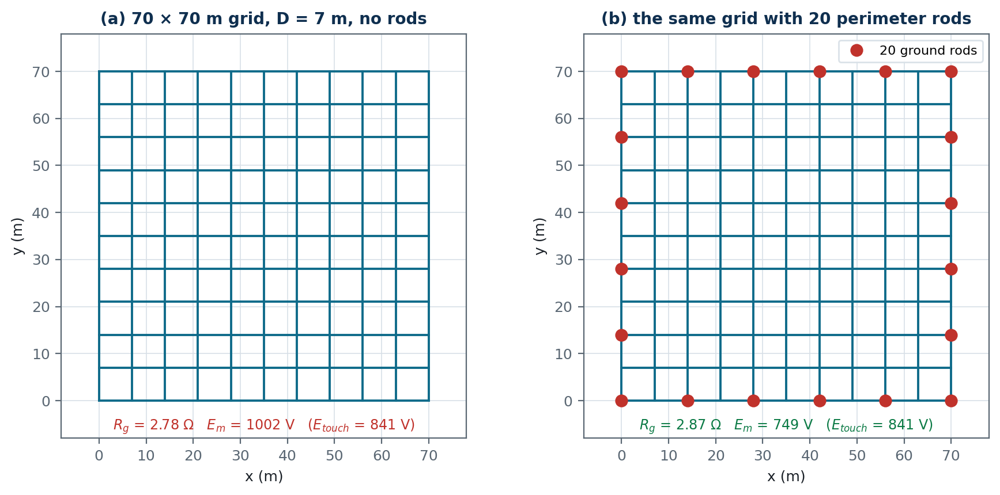

*Figure 9 — The IEEE 80 Annex B grid, without and with perimeter rods. Adding twenty 7.5 m rods changes the resistance by only about 5 %, but it changes the mesh voltage far more — because the rods raise the effective mesh length and set K_ii to 1.*

### 6.2 Schwarz — when rods are present

Sverak treats all buried metal alike. Schwarz splits it into the horizontal grid (`R₁`),
the rod bed (`R₂`) and their mutual resistance (`R_m`), then combines them as two coupled
electrodes:

```
R_g = (R₁R₂ − R_m²) / (R₁ + R₂ − 2R_m)          … (6.2)
```

This is the standard formula for two coupled conductors — not a parallel combination,
because the grid and the rods occupy overlapping volumes of soil and therefore "compete"
for the same current paths. `R_m` quantifies that competition; if you (wrongly) set
`R_m = 0`, (6.2) collapses to the parallel formula and gives an optimistic answer.

### 6.3 Why rods earn their keep in layered soil

In uniform soil, rods add little that the same length of horizontal conductor would not.
Their value appears when `ρ₂ < ρ₁`: a 6 m rod through a 2 m resistive top layer reaches
soil that may be five times more conductive, and its resistance drops accordingly. Because
the closed-form equations use a single equivalent resistivity, **they systematically
understate this benefit** — which is exactly the case where the numerical solver, with the
true two-layer Green's function, earns its place.

---

## 7. Mesh and step voltage — module 4
This is the part of IEEE 80 that looks most like arbitrary curve-fitting. It is not — every
factor has a job. Here is what each one does.

### 7.1 The physical picture

Inside the grid the soil potential is not flat. Directly above a buried conductor it is
close to GPR; midway between two conductors it sags. The sag is the touch voltage. It is
largest **at the centre of a corner mesh**, because that point has the fewest conductors
near it — the corner has metal on only two sides instead of four.

So the design quantity `E_m` is defined as *the touch voltage at the centre of the corner
mesh*. It is not an average; it is the worst case.

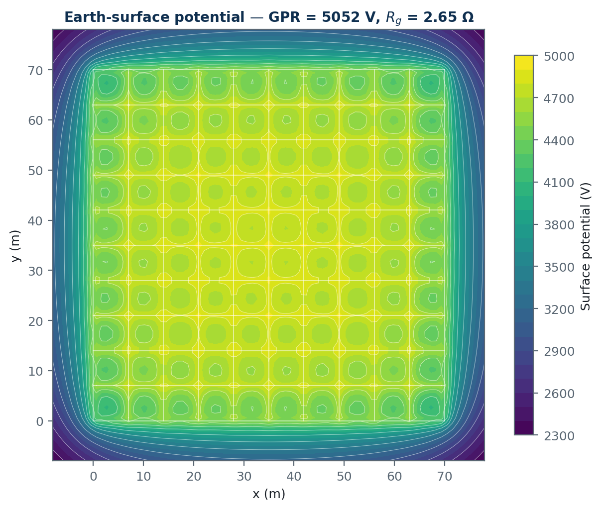

*Figure 10 — Earth-surface potential computed by the boundary-element solver for the Annex B grid. The potential is nearly flat inside the grid and falls steeply outside it; the small dips are the mesh centres.*

### 7.2 The mesh factor `K_m`

```
K_m = (1/2π) { ln[ D²/(16hd) + (D+2h)²/(8Dd) − h/(4d) ] + (K_ii/K_h) ln[8/(π(2n−1))] }   … (7.1)
```

Term by term:

- `D²/(16hd)` — the direct contribution of the two conductors bounding the mesh, from the
  potential of a buried line source and its image. The `D²` says the sag grows with the
  square of the spacing: **halving `D` is worth far more than adding conductor anywhere
  else.**
- `(D+2h)²/(8Dd)` — the image of those conductors in the earth's surface.
- `−h/(4d)` — a correction for the finite burial depth.
- `ln[8/(π(2n−1))]` — the contribution of all the *other* conductors in the grid, which
  raise the potential at the corner mesh and therefore reduce the sag. It gets more
  negative as `n` grows, i.e. a bigger grid helps its own corner.
- `K_ii` — a correction for grids **without** rods on the perimeter. With perimeter rods
  `K_ii = 1`; without, `K_ii = 1/(2n)^(2/n) < 1`, which reduces the correcting term. This
  is the mathematical statement of the rule "always put rods in the corners".
- `K_h = √(1 + h/h₀)`, `h₀ = 1 m` — depth weighting.

### 7.3 The geometric factor `n` and the irregularity factor `K_i`

```
n = n_a · n_b · n_c · n_d,     n_a = 2L_C/L_p          … (7.2)
K_i = 0.644 + 0.148 n                                   … (7.3)
```

`n_a` is an "effective number of parallel conductors": total conductor length divided by
half the perimeter. For a square grid with 11 conductors each way, `n_a = 2×1540/280 = 11`
— it recovers the actual conductor count exactly, which is a good sanity check to show
students. `n_b`, `n_c`, `n_d` are shape corrections and equal 1 for a square grid; they
depart from 1 for rectangles, L-shapes and irregular outlines.

`K_i` is an empirical correction for the fact that current does **not** leave the grid
uniformly. It concentrates at the edges and especially at the corners — the same
edge-singularity behaviour you meet in electrostatics. `K_i` grows linearly with `n`
because a larger grid has proportionally more of its current forced out at the perimeter.

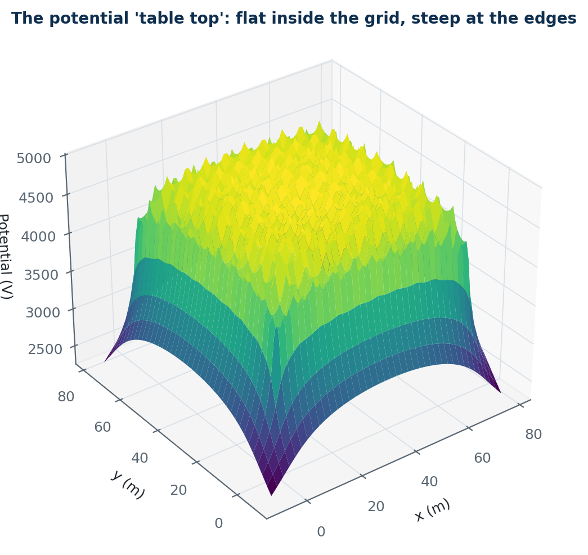

*Figure 11 — The same solution as a surface. The 'table top' shape is the whole objective of an earth grid: a flat interior means small touch voltages, and the steep edges are where step voltage is worst.*

### 7.4 The step factor `K_s`

```
K_s = (1/π) [ 1/(2h) + 1/(D+h) + (1/D)(1 − 0.5^(n−2)) ]          … (7.4)
```

The `1/(2h)` term dominates and it is the whole story: the steepest surface gradient sits
directly above the outermost conductor, and it is inversely proportional to burial depth.
**Depth is the step-voltage lever; spacing is the touch-voltage lever.**

### 7.5 The effective lengths

```
E_m = ρ K_m K_i I_G / L_M          E_s = ρ K_s K_i I_G / L_S
```

`L_M` and `L_S` are *not* the physical conductor lengths — they are the lengths weighted
by how much each element contributes to the quantity in question:

```
L_M = L_C + L_R                                       (no perimeter rods)
L_M = L_C + [1.55 + 1.22 (L_r/√(L_x²+L_y²))] L_R      (rods on the perimeter)
L_S = 0.75 L_C + 0.85 L_R
```

The `1.55 + 1.22(...)` weighting says a perimeter rod is worth about **1.6 to 1.8 times
its own length** of horizontal conductor for controlling touch voltage — because it is at
the corner, where the current concentrates, and because it reaches deeper soil. In `L_S`
the weights are *less* than one (0.75 and 0.85), because for step voltage the far parts of
the grid help less than the local conductor does.

### 7.6 How to read a failure

When `E_m` exceeds `E_touch`, Earthing System tells you which lever to pull and by how much.
The physics behind each:

| Lever | Effect | Why |
|---|---|---|
| Reduce `D` | Strong | `K_m` falls roughly as `ln D²`, and `L_M` rises |
| Add perimeter rods | Strong | `K_ii → 1` and `L_M` gains 1.6× the rod length |
| Thicker surface layer | Moderate, saturating | Raises `C_s` and so `E_touch` |
| Faster clearing | Strong | `E_touch ∝ 1/√t_s` |
| Lower `S_f` | Strong | `E_m ∝ I_G` |
| Bigger area | Weak for touch | Lowers `R_g` and GPR but barely changes the local sag |

The last row is the one students get wrong most often.

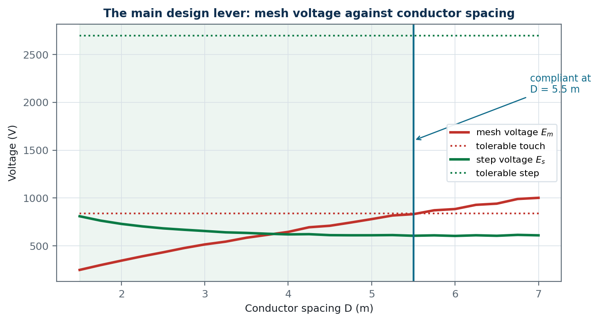

*Figure 12 — The principal design lever. Mesh and step voltage against conductor spacing for the Annex B case, with the tolerable limits. The design becomes compliant when the mesh-voltage curve crosses below its limit.*

---

## 8. The numerical solver — module 5
### 8.1 What the closed forms cannot do

IEEE 80's equations assume a rectangular (or L/T-shaped) grid, uniform soil and — crucially
— **uniform current leakage from every part of the electrode**. Real problems break all
three: sites are irregular, soil is layered, and current leaves the perimeter far more
readily than the middle.

### 8.2 The method of moments

Discretise the buried metal into `N` short cylindrical segments. Assume each segment `j`
leaks a uniform current `I_j` into the soil. Because the metal is bonded, every segment
must sit at the **same** potential `V`. That gives `N` equations

```
Σ_j P_ij I_j = V     for every i          … (8.1)
```

plus one more, current conservation, `Σ_j I_j = I_G`. Together:

```
⎡ P   −1 ⎤ ⎡ I ⎤   ⎡ 0  ⎤
⎣ 1ᵀ   0 ⎦ ⎣ V ⎦ = ⎣ I_G ⎦          R_g = V / I_G          … (8.2)
```

`P_ij` is the average potential appearing on segment `i` per ampere leaked from segment
`j`. This is a **potential-coefficient matrix**, exactly analogous to the capacitance
coefficient matrix in electrostatics — and indeed the two problems are mathematically
identical, because both solve Laplace's equation with the same boundary conditions.

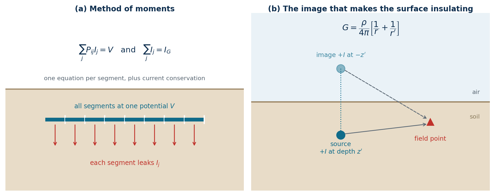

*Figure 13 — The boundary-element formulation. (a) The electrode is divided into segments, each leaking a uniform current, all held at one potential. (b) The insulating soil surface is enforced by an image source of the same sign at the mirrored depth.*

### 8.3 The Green's function and the image

The kernel is the potential of a point current source in a half-space. The soil surface is
a boundary with no current crossing it (air does not conduct), which is enforced by placing
an **image source of the same sign** at the mirrored depth — the opposite sign convention
to the grounded-plane problem in electrostatics, and a good exam question:

```
G(field, source) = ρ/(4π) [ 1/√(r_h² + (z−z')²) + 1/√(r_h² + (z+z')²) ]          … (8.3)
```

with `z` measured downwards from the surface. Note `ρ/4π`, not `ρ/2π` — the factor of two
that turns it into (1.1) comes from the image term when both points are on the surface.

**Two-layer soil.** With a lower layer of resistivity `ρ₂` below depth `h`, and
`K = (ρ₂ − ρ₁)/(ρ₂ + ρ₁)`, the image series depends on which layer the source and the field
point are in (image depth written as `±z' + shift`):

```
both in layer 1   ρ₁/4π  Σ Kⁿ [ images at ±z' ± 2nh ]            (n = 0 is (8.3))
field in layer 2  ρ₁(1+K)/4π  Σ Kⁿ [ z' − 2nh,  −z' − 2nh ]
source in layer 2 ρ₁(1+K)/4π  Σ Kⁿ [ z' + 2nh,  −z' − 2nh ]
both in layer 2   ρ₂/4π [ z',  −K at 2h − z',  (1−K²) Σ Kⁿ at −z' − 2nh ]
```

Every conductor that crosses the interface is split there, and each segment uses the
function of its own layer, including `ρ₂` in its self term. (Version 1.1 applied the
first line to every segment, so rods below the interface saw `ρ₁`: for the Annex B grid
with twenty 7.5 m rods over 100 Ω·m, `R_g` came out 2.0 % low.) The potential is
continuous across the interface to six digits, which is a useful test of the four
functions.

### 8.4 The self term — a derivation worth doing

For `i = j` the integral is singular and must be done analytically. For a segment of length
`L` and radius `a` with uniform current, the average potential on it is

```
V = ρI/(4πL²) ∫₀^L ∫₀^L ds ds' / √((s−s')² + a²)
  = ρI/(4πL²) · 2[ L·asinh(L/a) − (√(L²+a²) − a) ]
  ≈ ρ/(2πL) [ ln(2L/a) − 1 ] · I     for a ≪ L          … (8.4)
```

**Check it against Dwight.** Take a vertical rod of length `L` from the surface. Its image
is a collinear rod of the same length just above. The image contribution is

```
ρI/(4πL²) ∫₀^L ∫₀^L ds ds'/(s+s') = ρI/(4πL²) · 2L ln2 = ρ I ln2/(2πL)
```

so the total is

```
R = ρ/(2πL)[ln(2L/a) − 1 + ln 2] = ρ/(2πL)[ln(4L/a) − 1]
```

which is exactly Dwight's rod formula, and identical to IEEE 80's `ρ/(2πL)[ln(8L/d) − 1]`
since `d = 2a`. The software reproduces this to better than 0.2 % with a single segment —
a test worth running in front of a class.

### 8.5 Collocation versus Galerkin — a real trap

The cheap way to fill `P` is **collocation**: evaluate the potential at the *midpoint* of
segment `i`. For distant sources that is fine. For close sources it is badly wrong, because
the potential varies strongly across the segment and the midpoint value is not the average.

Concretely: for a segment and its own surface image at depth 0.8 m, midpoint collocation
underestimates the image contribution by about 21 %. Accumulated over a whole grid this
biased the computed earth resistance **5 to 15 % low** — an error in the unsafe direction.

Earthing System therefore uses **Galerkin double quadrature** (averaging over the field segment
as well as the source segment) for all near pairs, including the self-image pair, and keeps
cheap collocation only for far pairs. This is the single most important implementation
detail in `bem.py`, and it is the sort of thing that separates a solver you can trust from
one that merely runs.

### 8.6 Two-layer soil

The same image series as §2.4, now in three dimensions:

```
G = ρ₁/(4π) Σ(n=−N..N) K^|n| [ 1/√(r_h² + (z − z' − 2nh)²)
                             + 1/√(r_h² + (z + z' − 2nh)²) ]          … (8.5)
```

At `n = 0` this reduces to (8.3). At `K = 0` all other terms vanish. Both are checked in
the test suite, and both are good student exercises.

### 8.7 What to compare, and why it matters

After solving, evaluate the touch voltage at the centre of the corner mesh and compare it
with the closed-form `E_m`. For the Annex B grid: **931 V numerical against 1002 V
closed-form, a 7 % difference.** The two methods share no equations, so agreement at this
level is strong evidence that both are right.

Expect the numerical value to be slightly *lower*, and understand why: the closed forms
assume uniform leakage current, whereas the real (and computed) distribution concentrates
at the edges, which flattens the potential in the interior. A disagreement much larger than
about 15 % means the grid is violating an assumption of the closed forms — usually shape
irregularity or strong soil layering — and the numerical answer is the one to believe.

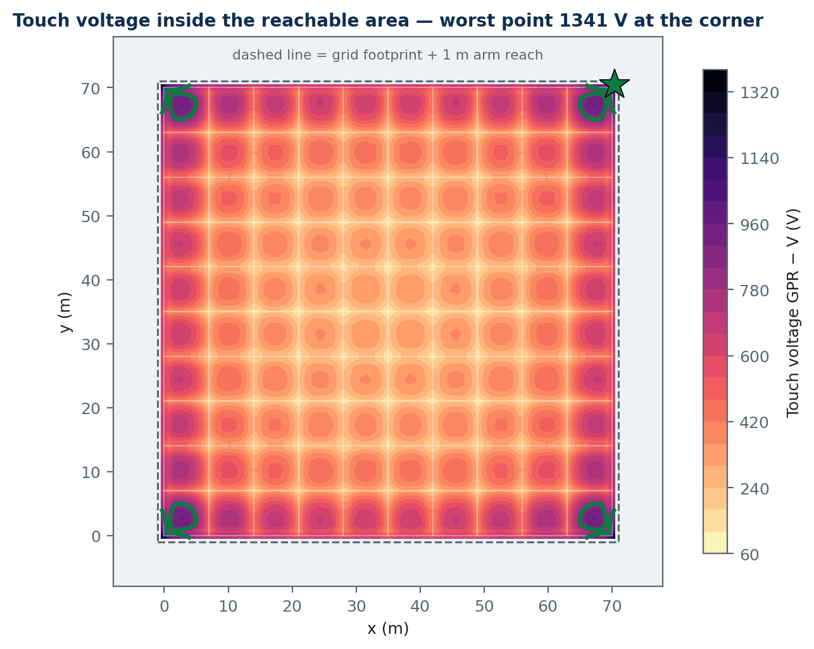

*Figure 14 — Touch voltage over the reachable area, with the tolerable contour drawn in green. Everything outside that contour fails. This is what the closed-form equations cannot show you: exactly where the problem is.*

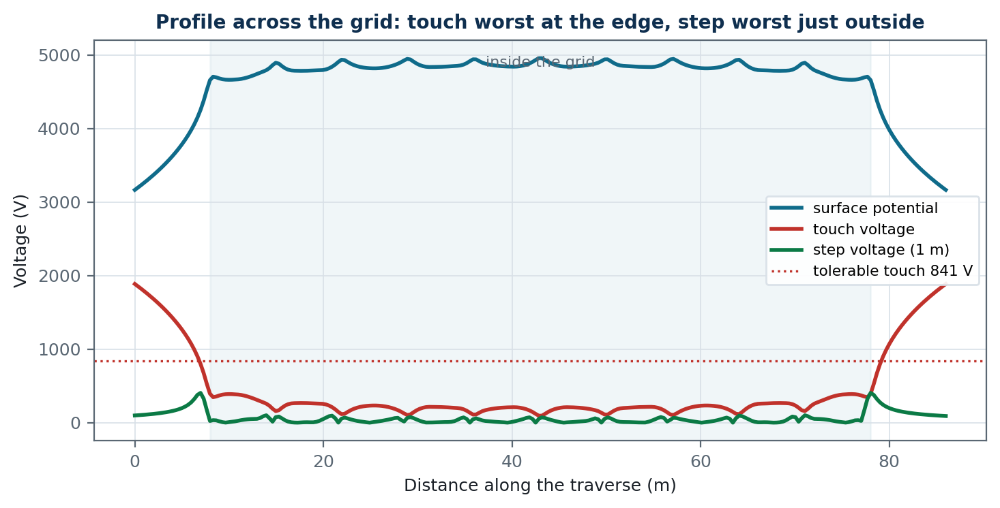

*Figure 15 — A traverse across the middle of the grid. Touch voltage is largest at the grid edge; step voltage peaks just outside the perimeter conductor, where the surface gradient is steepest.*

---

## 9. Buildings and homes — module 6
### 9.1 The system types, and what actually differs

The letters are a code: the **first** letter is how the source is earthed, the **second**
is how the installation's exposed metal is earthed.

| System | Source | Exposed metal | Fault path | Consequence |
|---|---|---|---|---|
| **TN-S** | Earthed | To source via a separate PE | Metallic | Large fault current; overcurrent device trips |
| **TN-C** | Earthed | Combined PEN | Metallic | No RCD possible downstream of the PEN |
| **TN-C-S** | Earthed | PEN split into N and PE at the origin | Metallic | Common utility arrangement (PME) |
| **TT** | Earthed | Own local electrode | **Through the soil** | Small fault current; RCD effectively mandatory |
| **IT** | Isolated or high-impedance | Local electrode | First fault limited by capacitance | Continuity; needs insulation monitoring |

The single most important teaching point: **in TN the fault current is large and the
criterion is on time; in TT the fault current is small and the criterion is on voltage.**
Everything else follows.


*Figure 16 — The two fault paths. In TN the return is metallic and the fault current is large enough to operate an overcurrent device; in TT it returns through the soil and is far too small, so the criterion becomes a limit on touch voltage and an RCD is required.*

### 9.2 The TN criterion

```
Z_s · I_a ≤ C_min · U₀          … (9.1)
```

`I_a` is the current that operates the device within the time of Table 41.1 (0.4 s for a
230 V final circuit, 5 s for a distribution circuit). For a type B breaker `I_a = 5I_n`,
type C `10I_n`, type D `20I_n`. `C_min = 0.95` allows for a low supply voltage.

Why the times differ: 0.4 s is the exposure a person may credibly receive from a portable
appliance they are holding; 5 s applies to fixed distribution equipment they are unlikely
to be touching when the fault occurs. Both trace back to the same `I_B = k/√t` curve.

### 9.3 The TT criterion

The fault current returns through the soil, through `R_A` in series with the source
electrode. That is typically a few tens of ohms, giving a few amperes — nowhere near enough
to trip a 32 A breaker. So the criterion becomes a voltage one:

```
R_A · I_a ≤ U_L = 50 V          … (9.2)
```

With an RCD, `I_a = IΔn`. For a 30 mA RCD, `R_A ≤ 50/0.03 = 1667 Ω` — essentially any
electrode qualifies. For a 300 mA RCD, `R_A ≤ 167 Ω`. **This is why RCDs are mandatory in
practice in TT systems**, and why the software's remedy text always offers "use a more
sensitive RCD" as the first option: it relaxes the electrode requirement in direct
proportion.

### 9.4 Electrode formulas

All of these come from the same half-space potential theory as §1.2, with the electrode
geometry changing the boundary condition.

**Vertical rod** (Dwight, derived in §8.4):

```
R = ρ/(2πL) [ ln(8L/d) − 1 ]          … (9.3)
```

The logarithm is the key: **doubling the length does much more than doubling the
diameter**. Going from 12 mm to 25 mm rod diameter changes `R` by about 12 %; going from
1.5 m to 3 m changes it by about 40 %.

**Horizontal conductor of total length `L` at depth `h`** (Dwight, IEEE 142 Table 4.2,
written with the half-length `ℓ = L/2` and `s = 2h`):

```
R = ρ/(4πℓ) [ ln(4ℓ/a) + ln(4ℓ/s) − 2 + s/(2ℓ) − s²/(16ℓ²) + … ]          … (9.4)
```

> **A published-formula trap.** Several references — including popular open-source code —
> quote this with `L` where Dwight's `2ℓ` belongs, which inflates the result by about 12 %
> for a 30 m tape. Earthing System was caught by this during validation: the boundary-element
> solver disagreed with the "textbook" formula by 11.6 %, and it turned out the solver was
> right. The two-method cross-check is what found it. Worth telling students as a lesson
> about trusting a single source.

**Plate, ring, foundation** follow the same pattern and are listed in `METHODS.md`. The
foundation electrode `R ≈ 0.2ρ/∛V` deserves a mention: concrete in contact with soil is a
surprisingly good conductor (its pore water is alkaline and ionic), and a building's own
foundation reinforcement is usually the cheapest low-resistance electrode available. It is
mandatory for new buildings in several countries for exactly this reason.

### 9.5 Electrodes in parallel — why you never get `R/n`

Two rods 1 m apart are almost the same electrode. Each one's current raises the potential
of the other's soil, so they interfere. The classical result:

```
R_n = (R₁/n)(1 + λα),     α = ρ/(2π R₁ s)          … (9.5)
```

where `s` is the spacing and `λ` the group factor. `λ` is not an empirical number: it is
the potential each rod receives from its neighbours, in units of `ρ/(2πs)`, averaged over
the group,

```
λ = (1/n) Σᵢ Σ_{j≠i} s / d_ij                                      … (9.6)
```

Earthing System uses the BS 7430 Table 5 values where they exist (rods in a line; hollow
square with 4, 8, 12, 16, 20 rods — 4.51 for eight) and evaluates (9.6) for the actual
layout otherwise, including the filled square. (Version 1.1 held line-like values for the
hollow square — 3.45 for eight rods — and line values for the filled square, both
optimistic.) The correction vanishes as `s → ∞` and grows as the rods crowd together.

**Dissimilar electrodes.** The same physics applies when a foundation electrode, a ring
and a rod group are bonded together. Module 6 represents each electrode by its
resistance `Rᵢ` and equivalent hemisphere radius `rᵢ = ρ/(2πRᵢ)`, takes the mutual
resistance of a pair as `min(ρ/(2π max(D, rᵢ + rⱼ)), Rᵢ, Rⱼ)` and solves `[R] I = V·1`,
so `R_A = 1/(1ᵀ[R]⁻¹1)`. Without a stated separation `D` the hemispheres are taken as
touching — the conservative case for one building plot. (Version 1.1 added them like
resistors in parallel.)

**Practical rule to teach:** space rods at least their own length apart, and preferably
twice. Four rods at 6 m spacing give about 3.1× the benefit of one; four rods at 1 m
spacing give barely 2×. The software computes the utilisation factor so students can see
this directly.

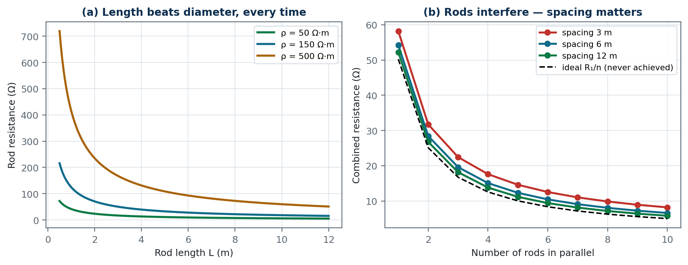

*Figure 17 — (a) Rod resistance against length for three soils — the logarithm means length always beats diameter. (b) Rods in parallel never reach the ideal R₁/n, and the shortfall grows as they are crowded together.*

### 9.6 The seasonal factor nobody plans for

`R_A` is measured once, in whatever season the commissioning happened. Soil dries in
summer and freezes in winter, and a rod electrode can easily **double** its resistance
between seasons. The margin the software reports on the TT check is not an academic
number — it is the seasonal allowance. Teach students to look at it, not just at the
PASS badge.

---

## 10. Lightning — module 7
### 10.1 Why power-frequency thinking fails

A lightning stroke has a rise time of about 1 µs, which corresponds to significant energy
up to a few megahertz. At those frequencies:

- The **inductance** of the down-conductor and the electrode dominates the impedance.
  A straight conductor has roughly 1 µH/m; at `di/dt = 100 kA/µs` that is 100 kV per metre.
  A 50 Hz resistance calculation is irrelevant to this.
- **Soil ionises** around the electrode when the local field exceeds roughly 300 kV/m,
  effectively enlarging the electrode and *reducing* its impulse impedance below its
  measured 50 Hz resistance.
- Only about the first 10–20 m of a long horizontal electrode carries useful current during
  the fast front — the rest is disconnected by its own inductance. This is why IEC 62305
  specifies **lengths and geometry**, not resistance.

That is the reason the 10 Ω figure in IEC 62305-3 is *informative* while the `l₁` geometry
requirement is *normative*. Earthing System's verdict text makes that distinction explicitly,
because students routinely invert it.

### 10.2 `l₁`, and Type A versus Type B

`l₁` (Figure 3) is the minimum electrode length, growing with soil resistivity and with
protection class. It is a proxy for "enough soil volume to disperse the charge".

- **Type A** — individual radial or vertical electrodes, at least two, each of length
  `≥ l₁` (horizontal) or `≥ 0.5 l₁` (vertical). Suitable for small structures.
- **Type B** — a ring electrode (or the foundation) with mean radius `r_e = √(A/π) ≥ l₁`.
  Preferred for larger structures and mandatory in practice where there is an electronic
  system to protect, because the ring also provides the equipotential reference.

If `r_e < l₁`, add `l_r = l₁ − r_e` horizontally or `l_v = (l₁ − r_e)/2` vertically at each
down-conductor. The software computes these directly.

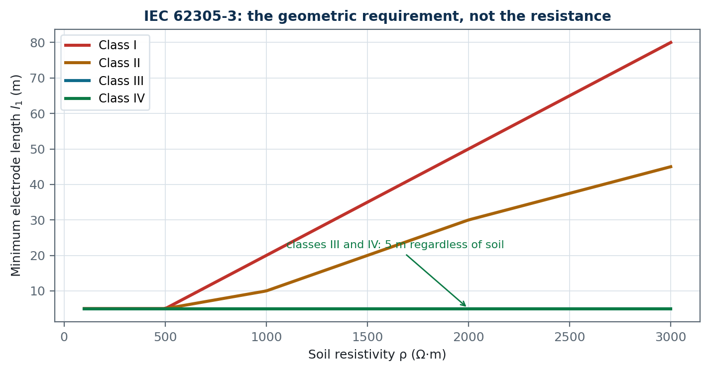

*Figure 18 — The minimum electrode length of IEC 62305-3 Figure 3. For classes III and IV it is 5 m whatever the soil; for classes I and II it grows steeply in resistive ground.*

### 10.3 Separation distance — the derivation

A down-conductor carrying a fraction of the stroke current develops a voltage along its
length, mostly inductive: `U ≈ L' · l · di/dt`. If nearby metal is at earth potential and
closer than the distance that voltage can flash over, you get a **side flash** — often into
the building's electrical or data wiring, which is far more damaging than the original
strike.

```
s = k_i · k_c · l / k_m          … (10.1)
```

- `k_i` encodes `di/dt` for the protection class: 0.08 (class I), 0.06 (II), 0.04 (III/IV).
- `k_c` is the **current division** among down-conductors: 1 for a single conductor, 0.66
  for two, 0.44 for four or more. More down-conductors, less current each, less voltage.
- `k_m` is the dielectric strength of the intervening material: **1 for air, 0.5 for
  concrete, brick or wood.**

That last one is counter-intuitive and worth stopping on: because `k_m` is in the
denominator, `k_m = 0.5` **doubles** the required separation. Solid building materials are
*worse* insulators than air over these distances — they are porous, absorb moisture, and
puncture rather than flash over. Students almost always guess the other way.

### 10.4 Effective length and effective area — putting a number on §10.1

Section 10.1 asserted that only the first ten or twenty metres of a long horizontal
electrode does any work during the front. That is worth turning into an equation, because
it changes what you build.

**The mechanism.** A buried conductor is a lossy transmission line: series inductance
`L'` per metre, and shunt conductance `G'` per metre to the soil. A step of current
injected at one end does not appear at the far end instantly — it diffuses along the line,
and while it is diffusing the conductance near the injection point is already bleeding it
into the soil. By the time the front has peaked, at `t = T`, the current has only reached
a limited distance. Beyond that distance the conductor is carrying almost nothing. The
diffusion length of such a line scales as `√(T/(L'G'))`, and since `G' ∝ 1/ρ` while `L'`
is essentially fixed by the geometry, the distance scales as `√(ρT)`. Fitting the constant
to measurements gives

```
L_eff = k · (ρ · T)^0.5      ρ in Ω·m, T in µs, L_eff in m      … (10.2)
        k = 1.40  fed at one end
        k = 1.55  fed at its centre
```

The centre-fed constant is larger only because the current has two directions to travel
in rather than one, so each half of the electrode sees half the current and the front gets
a little further.

Put the numbers of §10.1 in: 100 Ω·m soil, a 1 µs first negative stroke, fed at one end,
gives `L_eff = 1.4 × √100 = 14 m`. That is where the "10–20 m" came from. In 1000 Ω·m soil
it is 44 m; under a 0.25 µs subsequent stroke in 100 Ω·m it is only 7 m.

**The design consequence.** Electrode beyond `L_eff` is not merely of diminishing value —
during the front it is doing nothing at all. It still helps at power frequency, so a long
radial electrode is not wasted money if the same system also has to carry earth-fault
current. But if the reason you are adding it is lightning, adding *length* is the wrong
move; adding *conductor within the effective radius*, or moving the injection point, is
the right one.

### 10.5 The effective area of a meshed system, and why three formulas disagree

For a grid rather than a single radial electrode the same argument gives an **effective
radius** `r_eff` around the injection point, and an effective area `π r_eff²`. Three
published expressions are in common use and Earthing System reports all three:

```
Gupta & Thapar   r_eff = K (ρT)^0.5      K = 1.45 − 0.05 s   (centre-fed)
                                          K = 0.60 − 0.025 s  (corner-fed)
Conductor reach  r_eff = k (ρT)^0.5      equation (10.2) read as a radius
Grcev            r_eff = K exp[0.84 (ρT)^0.22]   K = 1 centre, 0.5 corner
```

where `s` is the mesh conductor spacing in metres. Gupta & Thapar's fit was made over
roughly 3 m to 15 m spacing; outside that band the linear `K` is an extrapolation and the
program says so.

Work the program's default switchyard: a 70 × 70 m grid at 7 m spacing in 400 Ω·m soil,
struck by a 1 µs front.

| | centre-fed | corner-fed |
|---|---|---|
| Gupta & Thapar | 22.0 m | 8.5 m |
| Conductor reach | 31.0 m | 28.0 m |
| Grcev | 23.1 m | 11.5 m |

The grid's own equivalent radius is `√(4900/π) = 39.5 m`. So on the most pessimistic
estimate, a corner-fed stroke puts **5 % of a 4900 m² grid to work**; on the most
optimistic, 50 %. That is a factor of six between two published formulas applied to the
same site, and it is not a defect in this program — it is the state of the published work.
Design on the smallest if the consequence of being wrong is an equipment failure, and on
the largest if it is only the cost of copper.

Two things the table does say unambiguously:

1. **Front time matters more than anything you can build.** Take the same grid to an 8 µs
   front and the centre-fed effective radius is 62 m — larger than the grid, so the whole
   thing participates. The 1 µs case is severe because it is fast, not because the grid is
   small.
2. **Where the current enters is a free design variable.** Every formula makes the
   corner-fed case roughly half the centre-fed one, because the current has a quadrant to
   spread into instead of the whole plane. Choosing which down-conductor lands where costs
   nothing and buys a factor of two.

### 10.6 Why the measured resistance flatters the design

This is the part that matters for safety. An earth resistance measured with a d.c. or 50 Hz
tester describes the whole electrode sitting at one potential. Under the front only the
effective part is carrying current, so the impedance the stroke actually sees is higher.

To first order, take the disc-electrode result `R = ρ/(4r)`: if only a radius `r_eff`
participates instead of the geometric `r_geom`, the impedance rises in the ratio of the
radii. Define the **impulse coefficient**

```
A = Z_impulse / R_measured ≈ r_geom / r_eff      (A ≥ 1)      … (10.3)
```

For the corner-fed 1 µs case above, `A ≈ 39.5 / 8.5 = 4.6`. A grid measured at 4.5 Ω
behaves like about 21 Ω during the front, and the peak earth potential rise for the class
III current of 100 kA is around **2100 kV rather than the 450 kV that I·R would give**.

Equation (10.3) is an estimate, not a measurement — a defensible number needs an impulse
test or a full transmission-line model, and it deliberately ignores soil ionisation, which
pushes the other way (§10.1) and can be significant at high current density. But it is the
right order and it points the right way, which is what a warning has to do. Size
equipotential bonding and SPD coordination on the impulse value; never quote the measured
resistance as if it described the lightning performance of an extended earthing system.

---

## 11. Air termination and protection zones — module 8
### 11.1 What the rolling sphere actually is

Module 7 asks where the lightning current goes once it is in the building. This module asks
the earlier question: **where does the flash attach in the first place, and what does that
attachment point protect?**

A downward leader descends in steps of a few tens of metres, and at each step it has not yet
"chosen" where it will land. It commits only when some earthed object comes within the
**striking distance** — the separation at which the field between the leader tip and that
object is enough to launch the connecting upward leader. The striking distance is set by the
charge already in the channel, and therefore by the peak current the stroke will carry:

```
r_s ≈ 10 · I^0.65          (metres, I in kA)          … (11.1)
```

Now roll that idea around. Draw a sphere of radius `r_s` centred on the leader tip. The
first earthed object the sphere touches is the object that gets struck. Sweep the leader tip
over every possible approach and the sphere sweeps out a surface: **everything the sphere can
touch is a possible strike point, and everything it cannot reach is protected.** That single
sentence is the whole of the rolling sphere method, and every closed-form result below is
derived from it rather than tabulated.

The class fixes the radius, because the class fixes the *smallest* current the system must
catch. A smaller minimum current means a shorter striking distance, a smaller sphere, and a
sphere that can nestle into more places — so a higher protection level is a *smaller* sphere:

| Class | `I_min` | Rolling sphere `R` | Mesh size | Interception probability |
|-------|---------|--------------------|-----------|--------------------------|
| I     | 3 kA    | 20 m               | 5 × 5 m   | 0.99 |
| II    | 5 kA    | 30 m               | 10 × 10 m | 0.97 |
| III   | 10 kA   | 45 m               | 15 × 15 m | 0.91 |
| IV    | 16 kA   | 60 m               | 20 × 20 m | 0.84 |

Note the direction of the trade: class IV misses about one flash in six of those below its
design current — but those are the weak strokes, which do the least damage.

### 11.2 Deriving the protected radius

Take one vertical air termination of height `h` standing on flat ground. A sphere resting on
the ground has its centre at height `R`. It touches the tip when the horizontal distance from
the mast is

```
a(h) = √(2·R·h − h²)                              … (11.2)
```

which is just the circle equation `x² + (R − h)² = R²` rearranged. Anything on the ground
closer than `a(h)` is under the arc and cannot be reached, so `a(h)` is the protected radius
at ground level. If instead you are protecting a plane at height `h_x` — a roof, a tank top,
a switchyard platform — the same construction on that plane gives

```
r_p = a(h) − a(h_x)                               … (11.3)
```

This is the formula every handbook quotes, and (11.2) is where it comes from.

Two consequences are worth dwelling on, because both are counter-intuitive:

- `a(h)` is maximum at `h = R` and **decreases** beyond it. Geometrically the sphere starts
  to nestle in beside a very tall mast. Physically the mast has become tall enough to be
  struck on its *side*, so its tip no longer shields the ground beside it. Once `h ≥ R` the
  mast body itself holds the sphere off at exactly `R`, and the protected radius saturates:
  `r_p = R − a(h_x)`. A taller mast is not indefinitely better.
- The protective angle method (§11.5) is *not* valid above `h = R` for exactly this reason:
  a cone has no way to express a radius that stops growing.

### 11.3 The sag between two terminations

Put two terminations of equal height `h` a distance `d` apart. A sphere resting on both has
its centre `√(R² − (d/2)²)` above the line joining the tips, so the lowest point the sphere
reaches on that span is depressed below the tips by the **penetration**, or sag:

```
p = R − √(R² − (d/2)²)                            … (11.4)
```

The protected height at mid-span is therefore `h − p`. Set that equal to the plane you are
protecting and solve for `d` to get the largest spacing you may use:

```
d_max = 2·√(R² − (R − h)²) = 2·a(h)               … (11.5)
```

This is the single most useful number on the page. It is also the number that catches people
out: on a 10 m building under class III (`R = 45 m`), 1 m rods on the two roof edges 20 m
apart give `p = 1.13 m` against a rod height of 1 m — the sphere reaches the roof by 130 mm
and the design fails. The remedy is 1.2 m rods, or one more rod, not a bigger earth
electrode. Earthing System reports `p`, the protected height at mid-span, and the tip height that
would be required at the spacing you entered.

### 11.4 Why roof edges and corners are special

A sphere resting on the *ground* beside the wall reaches the roof edge while it is still far
from the middle of the roof. So an air termination in the centre of a flat roof can protect
the whole roof field and still leave every edge and corner exposed. That is not a quirk of
the arithmetic; it is why IEC 62305-3 clause 5.2.3 asks for terminations on the corners and
along the exposed edges — in practice a perimeter conductor with short rods at the corners —
rather than relying on a single central mast.

Earthing System tests the roof field and the roof edges as two separate criteria, because the
remedy for each is different, and reports them separately in the elevation and in the report.

### 11.5 The protective angle method, and its limits

The protective angle method replaces the arc with a straight cone: a termination of height
`h` protects a cone of half-angle `α`, so a circle of radius `h·tan α` on the reference
plane. `α` is read from IEC 62305-3 Figure 1 as a function of `h` and the class, and the
method is permitted **only for simple shapes and only while `h ≤ R`**.

Two cautions belong with it:

- Figure 1 is published as a *graph*, not as a table of numbers. The values in
  `earthsys/airterm.py` are a digitisation of that graph and should be checked against your
  own copy of the standard before they go into a submitted design. The rolling sphere, by
  contrast, is derived exactly from (11.2)–(11.4), which is why Earthing System treats it as the
  governing result and shows the angle only for comparison.
- The two methods do not always agree, and neither is uniformly conservative. The program
  reports both radii side by side and says which is the smaller, so the disagreement is
  visible rather than hidden.

### 11.6 The mesh method

On a large flat roof, rolling a sphere would demand an impractical forest of rods. The mesh
method instead covers the surface with a conductor grid fine enough that no point of the
surface is further from a conductor than the mesh size for the class (5, 10, 15 or 20 m). The
mesh must follow the roof edges, take the shortest possible route, and be bonded to
down-conductors at typically 10–20 m of perimeter per conductor (Table 4). It is the normal
solution for a warehouse or a plant building; the rolling sphere is the normal solution for
a mast, a tank farm or an irregular structure.

### 11.7 How the module computes it

For anything more complicated than one or two masts on flat ground — masts of different
heights, a rod standing on a roof, a catenary wire, a building whose own edges intercept the
flash — there is no closed form. Earthing System therefore rolls the sphere numerically:

1. Every solid surface is **sampled into capture points**: the tips and shafts of the
   terminations, the roof line, the wall tops, any catenary.
2. A ball of radius `R` is **marched** over that point set from left to right. It either
   slides along the ground until it first touches a capture point, or pivots about the point
   it is resting on until it meets the next point — or falls back to the ground.
3. Each resting position, touching two supports, contributes one **arc of radius `R`** to the
   boundary of the protected volume. The sequence of arcs is the envelope drawn on the
   elevation.
4. The envelope is sampled into a height profile `z(x)`; anything below it is protected and
   anything on or above it can be touched.

The march reproduces (11.2) and (11.4) to within the sampling resolution, and the test suite
asserts exactly that — the closed form and the numerical roll check each other. What the
march adds is every case the closed form cannot express.

A last word on what this module does *not* do. It decides where the flash attaches and what
that attachment protects. It says nothing about the current once it is in the conductor —
that is module 7, and the two must both pass. A perfect air termination discharging into an
inadequate earth termination simply moves the damage.

---

## 12. System neutral grounding — module 9
### 11.1 The problem with an ungrounded system

An "ungrounded" system is not isolated from earth; it is capacitively coupled to it through
the distributed cable capacitance `C₀`. A single earth fault therefore draws only the
charging current `3I_C0`, and the system keeps running — which is why ungrounded systems
were popular.

The failure mode is the **arcing (restriking) ground fault**. The arc extinguishes at a
current zero, leaving the healthy phases charged. Half a cycle later the recovery voltage
restrikes the arc, pumping more energy into the L-C circuit. Each restrike ratchets the
trapped charge up, and voltages of 5–6 per unit can develop — puncturing insulation
somewhere else entirely, often in a machine winding far from the original fault.

### 11.2 High-resistance grounding — why `I_R ≥ 3I_C0`

Insert a resistor in the neutral. Now the fault circuit is `R` in parallel with the
capacitive path. The resistor **drains the trapped charge** between half cycles, so the
ratchet cannot build. The criterion is that the resistive current must at least equal the
capacitive current:

```
I_R ≥ 3 I_C0,     R_N = V_LN / I_R          … (11.1)
```

Satisfying it limits transient overvoltage to about 2.5 per unit, which insulation can
withstand indefinitely.

The first job on this page is therefore to estimate `3I_C0 = 3 · 2πf C₀ V_LN`, plus
allowances for motors and transformers. Cable capacitance dominates: a plant with 8 km of
6.6 kV cable at 0.25 µF/km has `3I_C0 ≈ 7 A`, so a resistor passing ~7 A (about 530 Ω)
does the job and the system can run with a standing earth fault while it is located.

**The limit of the method:** if `3I_C0` exceeds about 10 A the arc will not self-extinguish
and high-resistance grounding is no longer appropriate — move to low-resistance grounding
and trip on the first fault.

### 11.3 "Effectively grounded" and arrester selection

```
X₀/X₁ ≤ 3   and   R₀/X₁ ≤ 1          … (11.2)
```

When both hold, the healthy-phase voltage rise during an earth fault stays below about
1.4 per unit, and **80 % rated surge arresters** may be used. When they do not, the healthy
phases can approach full line voltage (1.73 pu) and full-rated arresters are required. This
is the direct link between the earthing philosophy and the insulation coordination of the
whole installation — a good closing point for a course, because it shows that earthing is
not a bolt-on but a system-level decision.

---

## 13. Reading a verdict

Every compliance row in Earthing System can be expanded to show four things. Teach students to
read them in this order:

1. **What the criterion means** — the physics being protected against. If they cannot state
   this, the number is meaningless to them.
2. **What drives the number** — the formula with the actual values substituted, so they can
   see which factor is large.
3. **Why it passed or failed** — the quantified comparison, with the percentage.
4. **How to fix it** — each remedy with its computed magnitude ("reduce `t_s` from 0.50 s
   to 0.35 s"), so the choice between levers is an engineering judgement about cost and
   feasibility rather than guesswork.

The same four blocks appear in the generated report, so a design review can be held on the
document alone.

**A caution to teach alongside the badges.** A PASS is a statement about a model, not about
a site. It is conditional on the soil model being right (measured, in the correct season),
on the fault current being right (from the utility's study, not a guess), and on the
installation matching the drawing. The report's disclaimer says this, and it should be read
aloud in class at least once.

---

## 14. A suggested teaching sequence

Four sessions of about two hours, each ending with the students running the software
themselves.

**Session 1 — Physics and soil (chapters 1–2).**
Derive `V = ρI/2πr`, the foot resistance, and the tolerable-voltage formulas. Then have
students measure or be given a Wenner traverse and invert it. Exercise: take the example
traverse, delete the two largest spacings, re-fit, and explain why `ρ₂` and `h` move so much
— it teaches what the data actually constrain.

**Session 2 — Fault current and conductors (chapters 3–4).**
Derive the decrement factor and the adiabatic equation. Exercise: size the same conductor
for a bolted joint and for an exothermic weld and compare the copper cost. Then vary `S_f`
from 1.0 to 0.2 and watch the whole design change.

**Session 3 — The grid (chapters 5–7).**
Reproduce IEEE 80 Annex B step by step by hand, then in the software, and confirm every
intermediate value. Exercise: it fails on mesh voltage — have each student fix it by a
different lever and compare the resulting designs on cost and robustness.

**Session 4 — Numerical methods and the rest (chapters 8–12).**
Run the same grid through the boundary-element solver and compare. Exercise: make the grid
L-shaped and observe that the closed-form and numerical answers now diverge; discuss which
to believe. Then a domestic TT design and a lightning earth termination, ten minutes each.
Finish on the rolling sphere: put 1 m rods on the two edges of a 20 m roof under class III,
watch it fail by 130 mm, and have the students find the three different ways to fix it —
taller rods, a third rod, or a finer mesh. It is the clearest demonstration in the whole
course that geometry, not resistance, is what protects a structure from a direct strike.

**Assessment idea.** Give each student a different soil traverse and fault level and ask
for a complete design report, generated by the software but with a written justification of
every input choice — because the software will happily compute a beautiful answer from
wrong inputs, and knowing which inputs matter is the actual skill.

---

## 15. Symbols

| Symbol | Meaning | Unit |
|---|---|---|
| ρ, ρ₁, ρ₂ | Soil resistivity; upper and lower layer | Ω·m |
| ρ_s | Surface-layer resistivity | Ω·m |
| ρₐ | Apparent resistivity from a field measurement | Ω·m |
| K | Reflection coefficient `(ρ₂−ρ₁)/(ρ₂+ρ₁)` | – |
| h | Burial depth, or upper-layer thickness | m |
| h_s | Surface-layer thickness | m |
| C_s | Surface derating factor | – |
| A | Grid area, or conductor cross-section | m², mm² |
| D | Conductor spacing in the grid | m |
| d | Conductor diameter | m |
| L_C, L_R, L_T | Horizontal, rod and total buried length | m |
| L_M, L_S | Effective length for mesh and step voltage | m |
| n, K_m, K_i, K_s, K_ii, K_h | IEEE 80 geometric factors | – |
| R_g, R_A | Earth resistance of a grid / installation electrode | Ω |
| GPR | Ground potential rise | V |
| E_m, E_s | Computed mesh (touch) and step voltage | V |
| E_touch, E_step | Tolerable touch and step voltage | V |
| I_B | Tolerable body current | A |
| R_B, R_f | Body and foot resistance | Ω |
| I_G, I_g, 3I₀ | Maximum grid, symmetrical grid, and zero-sequence current | A |
| D_f, S_f, C_p | Decrement, split and growth factors | – |
| T_a | DC time constant `X/(ωR)` | s |
| t_s, t_c, t_f | Shock, conductor and fault duration | s |
| TCAP, α_r, ρ_r, K₀, T_m | IEEE 80 material constants | – |
| k | IEC 60364 adiabatic constant | A·s^½/mm² |
| Z_s, Z_e, I_a | Loop impedance, external loop, device operating current | Ω, A |
| IΔn | RCD rated residual current | A |
| l₁, s, k_i, k_c, k_m | IEC 62305 electrode length and separation factors | m, – |
| 3I_C0, R_N | System charging current, neutral resistor | A, Ω |

---

## 16. The wider standards landscape

Earthing System computes to IEEE 80, IEC 60364, IEC 62305 and IEEE 142 (with IEC 60909 for the
fault current and BS 7430 for the rod factors). Version 1.3 places them among the other
standards a designer meets. `earthsys/standards.py` holds the registry (edition, status,
area, and whether the software *implements*, *cross-checks* or only *references* each) and
the small calculations below. None of them changes a verdict. The tutorial *Earthing System
Design — Theory and Practice* (2nd edition, version 2.1) derives each one: §5.4, §9.8–9.9,
§10.8–10.9 and Appendix F.

**Three families of touch-voltage criterion.**

- **IEEE 80.** Dalziel, `R_B = 1000 Ω`, and the surface layer through `C_s` (§5).
- **BS EN 50522:2022 and IEC 61936-1.** The permissible touch voltage `U_Tp(t_F)` comes
  from the IEC 60479-1:2018 body impedance and curve c2. The tabulated values are 716, 654,
  537, 220, 117, 96, 86 and 85 V at 0.05, 0.1, 0.2, 0.5, 1, 2, 5 and 10 s. Footwear and the
  surface layer enter as series resistances:
  `U_vTp = U_Tp + (R_F1 + 1.5·ρ_s)·U_Tp/Z_B(U_Tp)`. The like-for-like IEEE 80 value is the
  bare-soil limit `1000·k/√t`. At 0.5 s it is 222 V (70 kg), against `U_Tp = 220 V`.
- **AS 2067:2016 with ENA EG-0 and EG-1** (ENA DOC 025-2022 and 045-2022). The criterion is
  a risk. `P_coinc = f_n·p_n·(f_d + t_d)·T / (365·24·3600)` and
  `P_fatality = P_coinc·P_fib`. The risk is negligible below 10⁻⁶ per year, intolerable
  above 10⁻⁴, and ALARP between.

**Testing.** IEEE 81-2012 (now 81-2025) and, in the UK, ENA TS 41-24:2018. The latter adds
current-injection and slope methods for large grids, and maintenance testing.

**Fault-current distribution.** ENA EREC S34:2018 uses the reduction factor
`r = |1 − z_m/z_s|` of each return conductor. For a cable screen, `z_m = z_s − R_scr`, so
`r = R_scr/|z_s|`. A 0.2 Ω/km copper screen in 100 Ω·m soil gives `r = 0.29`: 71 % of the
fault current returns in the screen. CIGRE TB 347 covers the EPR transferred by specially
bonded screens.

**Wiring rules.** AS/NZS 3000:2018 (MEN), BS 7671:2018+A4:2026 (PME), and BS 7430 (the 2011
edition is implemented; the 2026 edition is published).

**Data centres and telecommunications.** IEC 60364-5-548 (withdrawn 2002), IEEE 1100-2005
and BS EN 50310 use a mesh bonding network with openings `a ≤ c/(10·f_max)`: 1 m at 30 MHz.
AS/NZS 3835.1 and EREC S34 bound the EPR zone at `x = ρ·I_E/(2π·V_lim)`. For 5.48 kA in
100 Ω·m, the 430 V boundary is at 203 m.

**Frequency-dependent soil (CIGRE TB 781).**
`σ(f) = σ0 + σ0·1.26·σ0^−0.73·(f/1 MHz)^0.54` (σ in mS/m), with the matching permittivity.
A 1000 Ω·m soil behaves as 627 Ω·m at 250 kHz. Using the low-frequency value is conservative
for the EPR. Module 7 reports the frequency-dependent value.

**Overhead lines and renewables.**

- AS/NZS 7000:2016 and CIGRE TB 839: the critical backflashover current is
  `I_c ≈ CFO/((1 − c)·R_i)`.
- IEC 61400-24 and IEEE 2760-2020 for wind. IEEE 2760 is sometimes miscited as 2870.
- IEEE 2778-2020 for solar.

**Pipelines and HVDC.**

- AS/NZS 4853:2012 and CIGRE TB 95: the Carson mutual impedance is
  `z_m = π²f·10⁻⁴ + j·4πf·10⁻⁴·ln(D_e/d)` Ω/km, with `D_e = 658.5·√(ρ/f)`, and the induced
  EMF is `E = k·|z_m|·L·I_f`.
- EPRI EL-2020: the electrode thermal limit `Δθ_max = V²/(2ρλ)` holds for any electrode
  shape, and Faraday's law `m = M·I·t/(z·F)` gives 9.13 kg of iron per ampere-year.

## References

**Standards implemented** (the calculations follow these editions)

1. IEEE Std 80-2013, *IEEE Guide for Safety in AC Substation Grounding* (incl. Cor 1-2015)
2. IEEE Std 81-2012, *IEEE Guide for Measuring Earth Resistivity, Ground Impedance, and Earth Surface Potentials of a Grounding System* (superseded by IEEE Std 81-2025)
3. IEEE Std 142-2007, *IEEE Recommended Practice for Grounding of Industrial and Commercial Power Systems* (Green Book)
4. IEEE Std C62.92 series, *IEEE Guide for the Application of Neutral Grounding in Electrical Utility Systems*
5. IEC 60364-4-41:2005+A1:2017, *Low-voltage electrical installations — Protection against electric shock*
6. IEC 60364-5-54:2011+A1:2021, *Earthing arrangements and protective conductors*
7. IEC 60909-0:2016, *Short-circuit currents in three-phase a.c. systems — Calculation of currents*
8. IEC 62305-1 and IEC 62305-3:2010, *Protection against lightning* (edition 3 of Part 3 published 2024)
9. BS 7430:2011+A1:2015, *Code of practice for protective earthing of electrical installations* (λ tables; replaced by BS 7430:2026)

**Standards cross-checked or referenced** (`earthsys/standards.py`)

*Substation earthing*

10. AS 2067:2016, *Substations and high voltage installations exceeding 1 kV a.c.*
11. BS EN 50522:2022+A1:2024, *Earthing of power installations exceeding 1 kV a.c.*
12. IEC 61936-1:2021, *Power installations exceeding 1 kV AC and 1.5 kV DC — Part 1: AC*
13. ENA DOC 045-2022, *Substation Earthing Guide* (EG-1), Energy Networks Australia

*Testing*

14. ENA TS 41-24 Issue 2 (2018), *Guidelines for the design, installation, testing and maintenance of main earthing systems in substations*, Energy Networks Association (UK)

*Touch and step voltage*

15. IEC 60479-1:2018, *Effects of current on human beings and livestock — Part 1: General aspects* (replaces IEC TS 60479-1:2005+A1:2016); IEC 60479-2:2019, *Part 2: Special aspects*
16. ENA DOC 025-2022, *Power System Earthing Guide — Part 1: Management Principles* (EG-0), Energy Networks Australia

*Renewable generation*

17. IEC 61400-24:2019+AMD1:2024, *Wind energy generation systems — Part 24: Lightning protection* (turbine earthing, built on IEC 62305-3)
18. IEEE Std 2760-2020, *IEEE Guide for Wind Power Plant Grounding System Design for Personnel Safety*
19. IEEE Std 2778-2020, *IEEE Guide for Solar Power Plant Grounding for Personnel Protection*

*Metallic pipelines*

20. AS/NZS 4853:2012, *Electrical hazards on metallic pipelines*
21. CIGRE TB 95 (1995), *Guide on the influence of high voltage AC power systems on metallic pipelines*

*Industrial and commercial installations*

22. AS/NZS 3000:2018, *Electrical installations* (Wiring Rules), with Amendments 1–3
23. BS 7671:2018+A4:2026, *Requirements for Electrical Installations* (IET Wiring Regulations, 18th Edition)

*Overhead lines*

24. AS/NZS 7000:2016, *Overhead line design*
25. CIGRE TB 781 (2019), *Impact of soil-parameter frequency dependence on the response of grounding electrodes and on the lightning performance of electrical systems*
26. CIGRE TB 839 (2021), *Procedures for estimating the lightning performance of transmission lines — new aspects*
27. IEEE Std 1243-1997, *IEEE Guide for Improving the Lightning Performance of Transmission Lines*

*HVDC*

28. EPRI EL-2020 (1981), *HVDC Ground Electrode Design*, Electric Power Research Institute

*Data centres*

29. IEC 60364-5-548:1996, *Earthing arrangements and equipotential bonding for information technology installations* (withdrawn 2002; content now in IEC 60364-5-54 and IEC 60364-4-44)
30. IEEE Std 1100-2005, *IEEE Recommended Practice for Powering and Grounding Electronic Equipment* (Emerald Book; inactive-reserved since 2021)

*Telecommunications*

31. AS/NZS 3835.1:2006, *Earth potential rise — Protection of telecommunications network users, personnel and plant — Code of practice*
32. BS EN 50310:2016+A1:2020, *Telecommunications bonding networks for buildings and other structures*

*Fault-current distribution*

33. ENA EREC S34 Issue 2 (2018), *A guide for assessing the rise of earth potential at electrical installations*, Energy Networks Association (UK)
34. CIGRE TB 347 (2008), *Earth potential rises in specially bonded screen systems*

**Papers and books**

35. H. B. Dwight, "Calculation of resistances to ground", *Trans. AIEE*, 55, 1936
36. E. D. Sunde, *Earth Conduction Effects in Transmission Systems*, Van Nostrand, 1949
37. J. R. Carson, "Wave propagation in overhead wires with ground return", *Bell Syst. Tech. J.*, 5, 1926
38. S. J. Schwarz, "Analytical expressions for resistance of grounding systems", *Trans. AIEE*, 73, 1954
39. C. F. Dalziel, "Threshold 60-cycle fibrillating currents", *Trans. AIEE*, 79, 1960
40. F. Dawalibi and D. Mukhedkar, "Optimum design of substation grounding in two-layer earth", *IEEE Trans. PAS*, 94, 1975
41. J. G. Sverak, "Sizing of ground conductors against fusing", *IEEE Trans. PAS*, 100, 1981
42. R. Alipio and S. Visacro, "Modeling the frequency dependence of electrical parameters of soil", *IEEE Trans. Electromagnetic Compatibility*, 56(5), 2014
